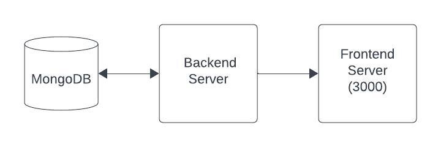
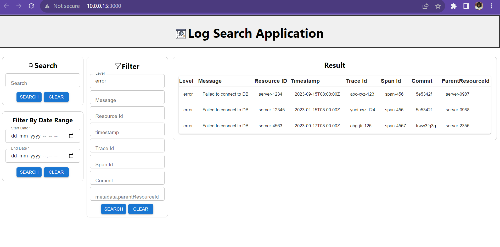
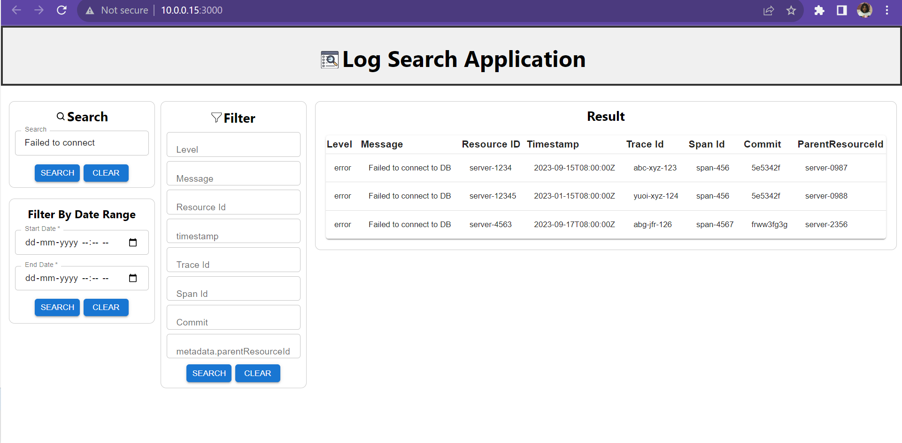
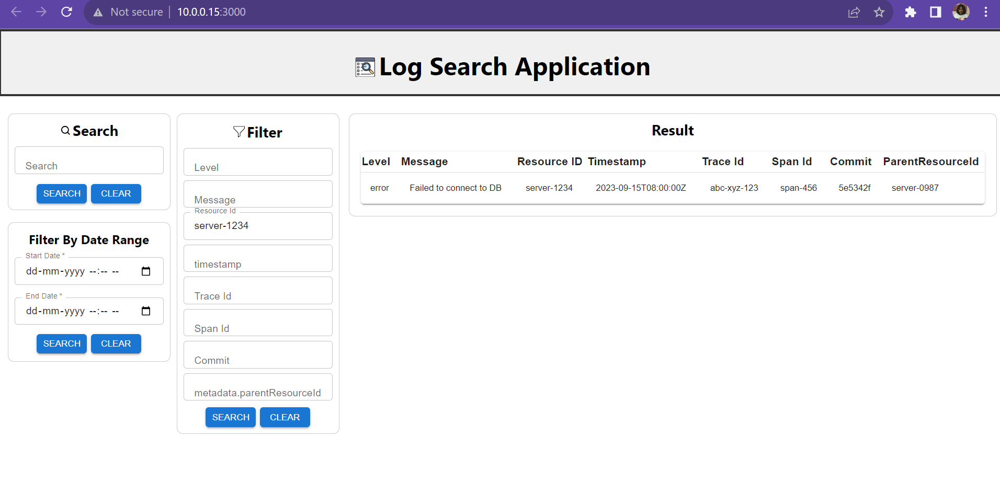
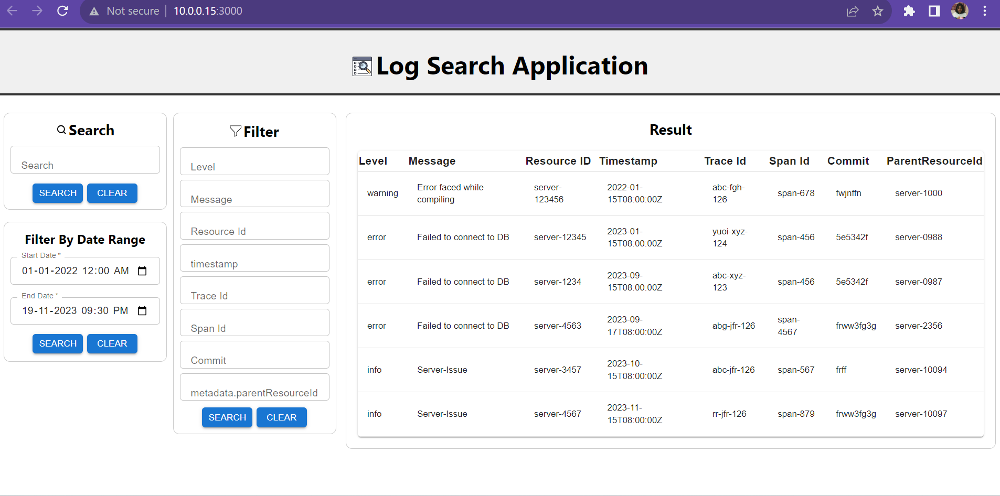

### Built With

Major frameworks/libraries

* ![Flask][Flask.com]
* ![Mongo][MongoDb]
* ![React][React.js]

<!-- GETTING STARTED -->
### Getting Started

## Setup

``` sh 
git clone https://github.com/dyte-submissions/november-2023-hiring-saka-2001.git
 ```

## Backend Setup

``` sh
cd dyte-submissions\november-2023-hiring-saka-2001\Backend

python -m venv venv

pip -r requirements.txt
```
## Frontend Setup
```sh
cd dyte-submissions\november-2023-hiring-saka-2001\Frontend

npm ci
```
## Run the Application

### Run Backend server

``` sh
cd dyte-submissions\november-2023-hiring-saka-2001\Backend

python src/app.py
```
### Run Frontend Server

``` sh
cd dyte-submissions\november-2023-hiring-saka-2001\Frontend

npm start
```
<p align="right">(<a href="#readme-top">back to top</a>)</p>

<!-- System Design -->
## System Design



<p align="right">(<a href="#readme-top">back to top</a>)</p>

<!-- Features Implemented -->
## Features Implemented

* Developed a mechanism to ingest logs in the provided format
* A Web UI for full-text search across logs
* Included filters based on level, message,   
  resourceId, timestamp, traceId, spanId, commit,  metadata.parentResourceId
* Implemented search within specific date ranges
* Allowed combining multiple filters

## Screenshots

Case 1: Find all logs with the level set to "error"



Case 2: Search for logs with the message containing the term "Failed to connect".



Case 3: Retrieve all logs related to resourceId "server-1234".



Case 4: - Filter logs between the timestamp



## Presentation
```sh
https://drive.google.com/file/d/1ogwgsOLFHZ_i3z2iLM_8kIDBAtLIUNns/view?usp=sharing
```


<!-- MARKDOWN LINKS & IMAGES -->
<!-- https://www.markdownguide.org/basic-syntax/#reference-style-links -->
[contributors-shield]: https://img.shields.io/github/contributors/othneildrew/Best-README-Template.svg?style=for-the-badge
[contributors-url]: https://github.com/othneildrew/Best-README-Template/graphs/contributors
[forks-shield]: https://img.shields.io/github/forks/othneildrew/Best-README-Template.svg?style=for-the-badge
[forks-url]: https://github.com/othneildrew/Best-README-Template/network/members
[stars-shield]: https://img.shields.io/github/stars/othneildrew/Best-README-Template.svg?style=for-the-badge
[stars-url]: https://github.com/othneildrew/Best-README-Template/stargazers
[issues-shield]: https://img.shields.io/github/issues/othneildrew/Best-README-Template.svg?style=for-the-badge
[linkedin-url]: https://linkedin.com/in/othneildrew
[product-screenshot]: images/screenshot.png
[Flask.com]:https://img.shields.io/badge/Flask-green?logo=flask
[MongoDb]:https://img.shields.io/badge/MongoDB-blue?logo=MongoDB
[React.js]: https://img.shields.io/badge/React-blue?logo=react
[React-url]: https://reactjs.org/

